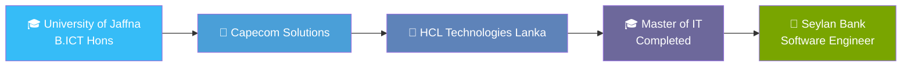

<div align="center">


<a href="https://github.com/kesavaram96"></a>
<a href="https://github.com/kesavaram96?tab=repositories"></a>
<a href="https://www.linkedin.com/in/kesavaraam-rathnasingam-7710a8180/"></a>


</div>


## 📖 The Short Version

I take requirements that sound simple in a meeting and turn them into systems that still behave correctly under real load. Most of that lives in **ASP.NET Core and SQL Server** — banking features, reservation platforms, document handling. Lately I'm splitting time with **AI agents / GenAI**, figuring out what's genuinely production-ready versus what's just a good demo.

```js
const kesavaraam = {
  role: "Software Engineer",
  base: "Sri Lanka 🇱🇰",
  daily_driver: ["C#", "ASP.NET Core", "SQL Server"],
  side_quest: ["Generative AI", "AI Agents", "Prompt Engineering"],
  philosophy: "simple enough to understand, strong enough to scale, flexible enough to evolve"
};
```


## 🧭 The Journey

<div align="center">



</div>


## 🧰 Stack

<p align="center">
  
</p>

<table align="center">
<tr><th align="left">Layer</th><th align="left">Tools</th></tr>
<tr><td>🏗️ Backend</td><td>ASP.NET Core · Web API · MVC · EF Core · JWT · Clean Architecture</td></tr>
<tr><td>🎨 Frontend</td><td>React · JavaScript · HTML5/CSS3 · Bootstrap · Material UI</td></tr>
<tr><td>🗄️ Data</td><td>SQL Server · MySQL · Query Optimization</td></tr>
<tr><td>⚙️ Platform</td><td>Dynamics 365 · Power Platform</td></tr>
<tr><td>☁️ DevOps</td><td>Git · GitHub · Docker · Azure DevOps</td></tr>
<tr><td>🤖 AI</td><td>LLMs · AI Agents · Prompt Engineering</td></tr>
</table>


## 📊 Profile Metrics

<p align="center">
  
  
</p>

<p align="center">
  
</p>

<p align="center">
  
</p>

<p align="center">
  
</p>

<p align="center">
  <picture>
    <source media="(prefers-color-scheme: dark)" srcset="https://raw.githubusercontent.com/kesavaram96/kesavaram96/output/github-contribution-grid-snake-dark.svg" />
    <source media="(prefers-color-scheme: light)" srcset="https://raw.githubusercontent.com/kesavaram96/kesavaram96/output/github-contribution-grid-snake.svg" />
    
  </picture>
</p>


## 🎓 Credentials

- 🎓 Master of Information Technology — Uva Wellassa University
- 🎓 Bachelor of Information and Communication Technology (Hons) — University of Jaffna
- 🏅 Microsoft Certified: Dynamics 365 Fundamentals (CRM)
- 🏅 Microsoft Certified: Power Platform Fundamentals
- 📄 Publication: *Agent-Based Product Selection in Multi Websites*


## 📡 Skill Signal

<p align="center">
  
</p>

<div align="center">

## 🤝 Let's Connect

<a href="https://github.com/kesavaram96"></a>
<a href="https://www.linkedin.com/in/kesavaraam-rathnasingam-7710a8180/"></a>

<i>Code. Build. Innovate.</i>

</div>


